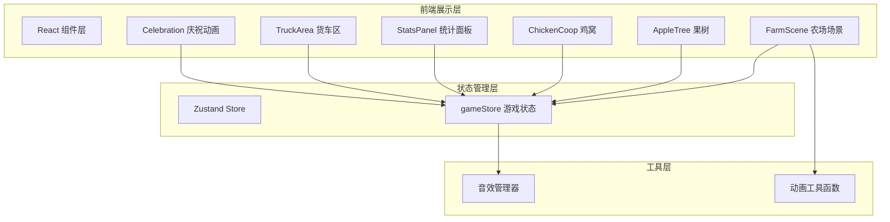

## 1. 架构设计



## 2. 技术说明

- 前端框架：React@18 + TypeScript + Vite
- 样式方案：Tailwind CSS@3 + CSS 动画
- 状态管理：Zustand
- 初始化工具：vite-init（react-ts 模板）
- 后端：无
- 数据库：无
- 音效：Web Audio API + 预加载音频文件
- 动画：CSS @keyframes + React Transition

## 3. 路由定义

| 路由 | 用途 |
|------|------|
| / | 游戏主页面，包含完整农场游戏场景 |

## 4. API 定义

无后端 API，所有数据在客户端 Zustand Store 中管理。

## 5. 数据模型

### 5.1 游戏状态数据模型

```typescript
interface GameState {
  appleCount: number
  eggCount: number
  trucks: Truck[]
  selectedTruckId: number | null
  gameStatus: 'playing' | 'celebrating'
  deliveryType: 'apple' | 'egg' | null
}

interface Truck {
  id: number
  target: number
  matched: boolean
  color: string
}
```

### 5.2 初始数据

```typescript
const initialTrucks: Truck[] = [
  { id: 1, target: 1, matched: false, color: '#E53935' },
  { id: 2, target: 2, matched: false, color: '#FFC107' },
  { id: 3, target: 3, matched: false, color: '#4CAF50' },
]
```

## 6. 组件结构

```
src/
├── components/
│   ├── FarmScene.tsx        # 农场场景主容器
│   ├── AppleTree.tsx        # 果树及苹果点击交互
│   ├── ChickenCoop.tsx      # 鸡窝及鸡蛋点击交互
│   ├── StatsPanel.tsx       # 数量统计面板
│   ├── TruckArea.tsx        # 货车匹配区域
│   ├── Truck.tsx            # 单辆货车
│   └── Celebration.tsx      # 庆祝动画组件
├── store/
│   └── gameStore.ts         # Zustand 游戏状态
├── utils/
│   ├── soundManager.ts      # 音效管理
│   └── animations.ts        # CSS 动画工具
├── pages/
│   └── GamePage.tsx         # 游戏页面
├── App.tsx
└── main.tsx
```
